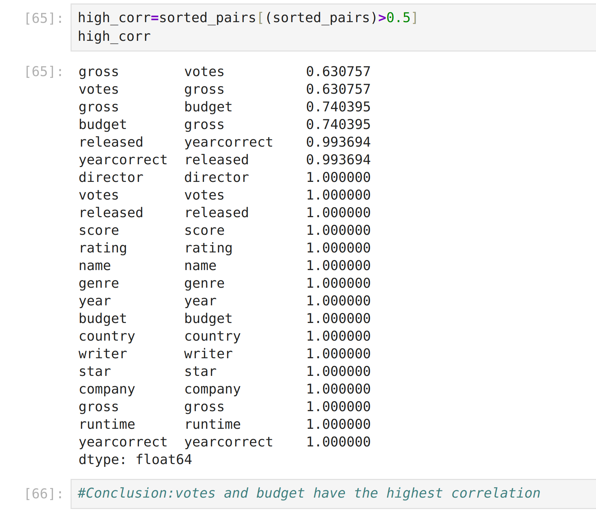

## Project: Movie Industry Data Analysis

### Overview
In this project, we analyze a dataset focused on the movie industry to uncover correlations between different variables such as budget, revenue, ratings, and genres. The dataset consists of movies spanning from 1986 to 2016 and contains various attributes that can help us answer critical questions about the industry.

### Dataset
The dataset used in this analysis is publicly available on Kaggle and contains information about 6820 movies. The key attributes include:
- **Budget**: Production cost of the movie
- **Company**: The production company
- **Country**: Country of origin
- **Director**: Name of the movie director
- **Genre**: Main genre classification
- **Gross Revenue**: Total revenue generated
- **Name**: Title of the movie
- **Rating**: Movie rating (R, PG, etc.)
- **Release Date**: Date of release
- **Runtime**: Movie duration in minutes
- **IMDb Score**: User rating on IMDb
- **Votes**: Number of IMDb user votes
- **Main Actor/Actress**: Lead performer in the movie
- **Writer**: Scriptwriter of the movie
- **Year**: Year of release

### Objectives

- Explore the correlation between Different attributes and revenue.

### Tools & Technologies
- **Python** (Pandas, NumPy, Matplotlib, Seaborn)
- **Jupyter Notebook** for exploratory data analysis
- **Kaggle** for dataset access

### Results & Insights

- votes and budget are positively correlated with Gross.
  

### Conclusion
This project provides a data-driven approach to understanding trends in the movie industry. Further analysis can include machine learning models for revenue prediction .

### Acknowledgments
- Dataset sourced from [Kaggle](https://www.kaggle.com/datasets/danielgrijalvas/movies/).

